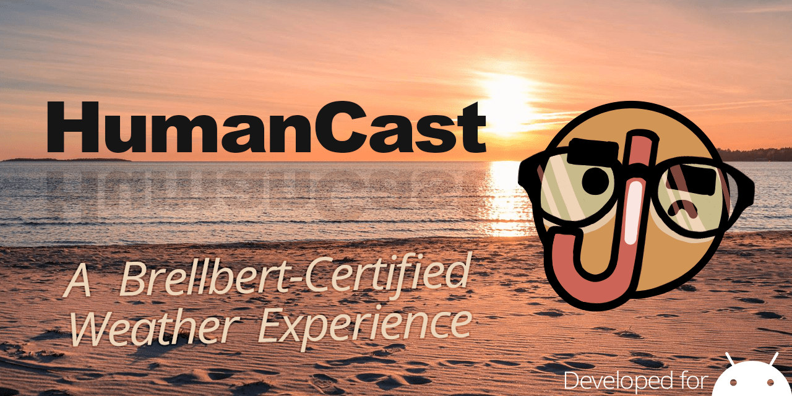

# HumanCast
HumanCast is a new app for Android that delivers accurate weather data, personalized forecasts, and tongue-in-cheek humor from your new weather pal, Brellbert.

# Goals For This Project

- Display Up-To-Date Weather Data
    - Use apparent temperature (because nothing else matters :P)
    - Note the impact of weather conditions (Super sunny days, rain, etc.)
    - Build a graph showing the day
    
- Allow feedback from the user day-to-day (Because, really, "cold" isn't the same for everyone. Looking at you, shorts-in-the-snow dude).
- Sync Data To The Cloud
- Have a lighthearted and clear UI

# Disclaimer
All Brellbert art is done by me and for the sake of this project. Reusing any of these assets is prohibited. Reposting is allowed if credit to the artist is given.
